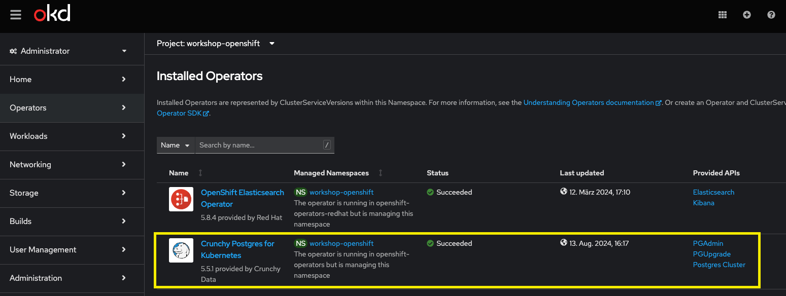

# Installing the database with the Postgresql Operator

** Note:** This currently does not work because of errors on pulling images in OpenShift.

The [Postgres Operator from Crunchy Data (PGO)](https://github.com/CrunchyData/postgres-operator)
is a declarative solution that automatically manages PostgreSQL clusters.

To learn about Operators in general, we can read [this article](https://www.redhat.com/en/technologies/cloud-computing/openshift/what-are-openshift-operators).

## Preconditions

First, we should check that the operator is installed in our OpenShift cluster:



## Generate the Postgres Cluster

We jsut run

```bash
oc apply -f Cluster.yaml
```

## Access the Database

We can then connect to the database using port forwarding:

```bash
oc port-forward $(oc get pods -o name --selector='postgres-operator.crunchydata.com/cluster=petclinic-db,postgres-operator.crunchydata.com/instance-set=instance1') 5432
# URL: jdbc:postgresql://localhost:5432/petclinic-db
# get username
oc get secret petclinic-db-pguser-petclinic-db -o jsonpath='{.data}' | jq -r '.["user"]' | base64 --decode
# get password
oc get secret petclinic-db-pguser-petclinic-db -o jsonpath='{.data}' | jq -r '.["password"]' | base64 --decode
```
