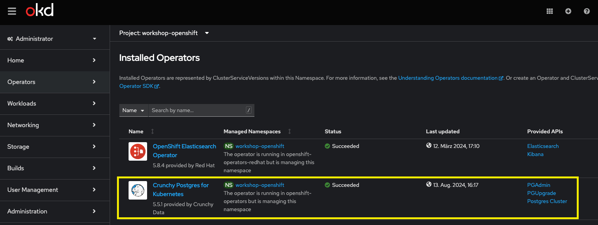

# Installing the database with the Postgresql Operator

The [Postgres Operator from Crunchy Data (PGO)](https://github.com/CrunchyData/postgres-operator)
is a declarative solution that automatically manages PostgreSQL clusters.

To learn about Operators in general, we can read [this article](https://www.redhat.com/en/technologies/cloud-computing/openshift/what-are-openshift-operators).

## Preconditions

First, we should check that the operator is installed in our OpenShift cluster:

